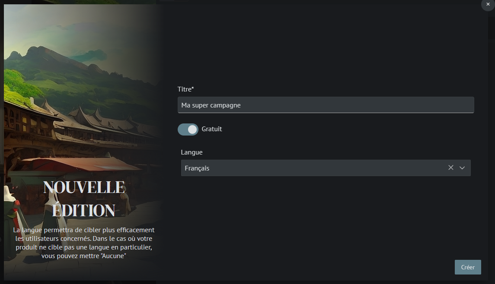
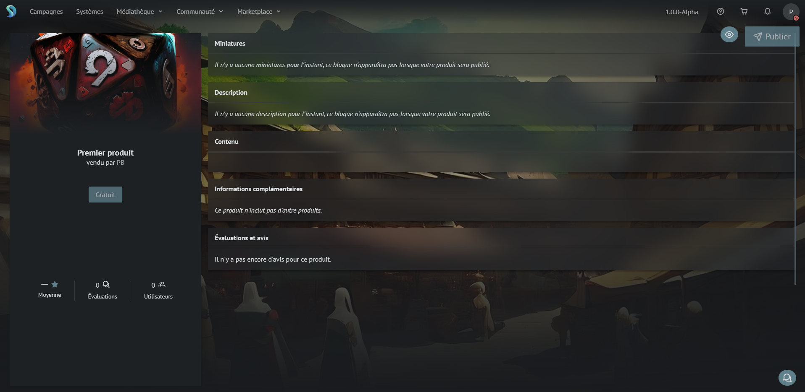
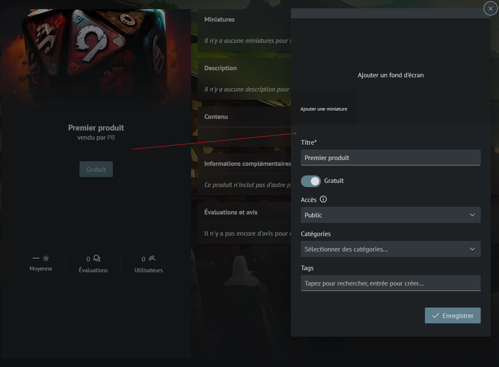
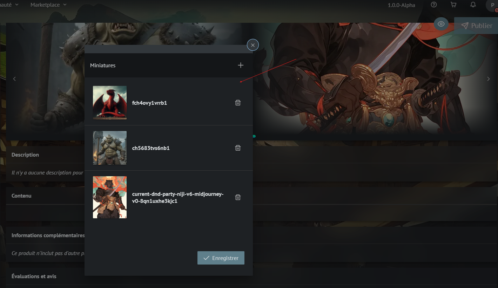
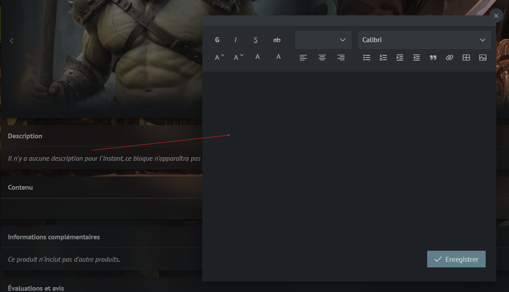
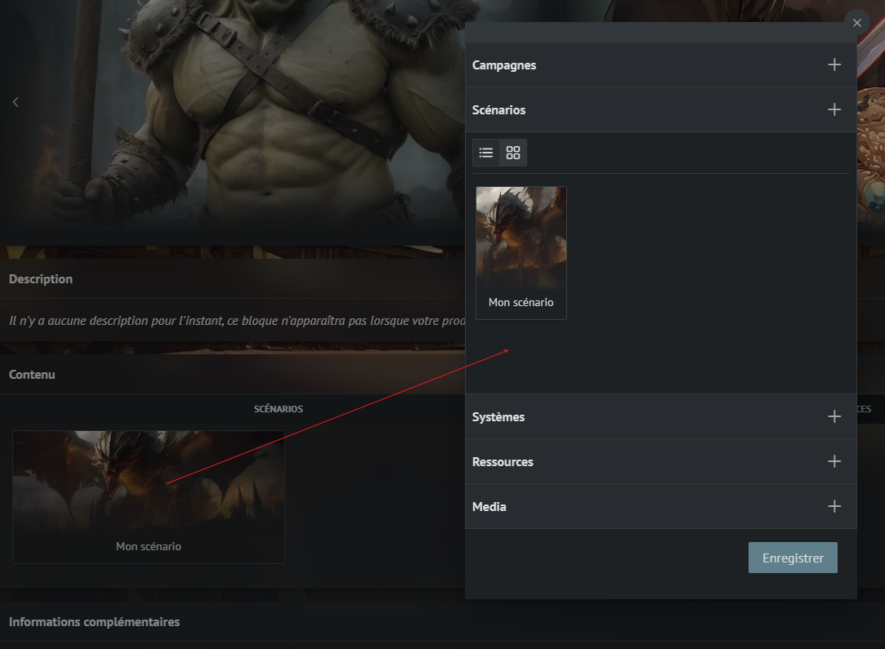
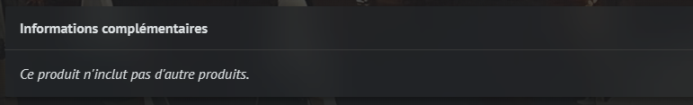
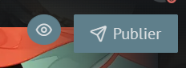
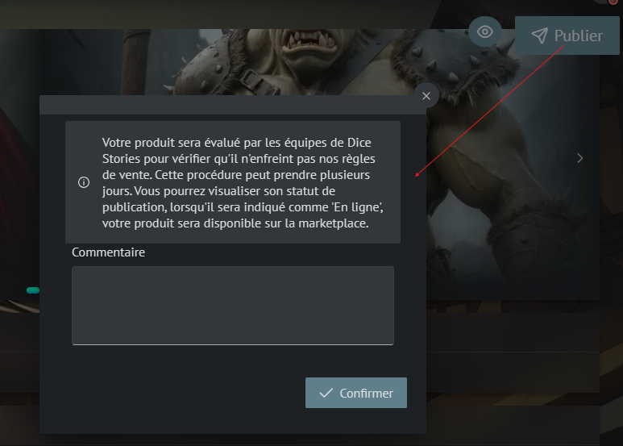

# Publier un produit

Ça y est, vous voulez partager vos créations à tous !
Dans Dice Stories il y a plusieurs notions pour partager du contenu :

- Les **produits**, c'est un élément uniquement visible par vous, voyez ça simplement comme un groupement d'éditions de produit.
- Des **éditions** de produits, ce sont elles qui seront visibles dans la marketplace. Une édition peut être _payante_ ou gratuite. Il peut être utile de créer plusieurs éditions dans un même produit pour par exemple proposer des contenus premium, gratuits, en plusieurs langues etc.
- Des **versions** d'éditions, c'est la définition du contenu d'un produit, sa description etc. Une version peut être publiée sur des accès différents (Public, Bêta, Alpha, Privé (sélection d'utilisateurs)). Si vous voulez qu'un panel réduit d'utilisateurs puissent tester votre produit avant de le publier à davantage d'utilisateurs, vous pouvez utiliser des accès différents.

_payante_ : Nécéssitera de créer un compte d'entreprise dédié, le processus est entièrement guidé, vous pouvez nous contacter pour toutes informations complémentaires.

## Votre premier produit

- Créez un produit depuis la page Marketplace > Mes Produits
- Puis créez une édition

- Personnalisez à votre envie

- En modifiant les informations générales vous pouvez modifier notamment la tarification, l'accès (public, beta, alpha, privé (sélection d'utilisateurs)), les catégories (utilisées pour promouvoir votre produit), les tags (utilisés pour identifier le contenu du produit et le filtrer) ainsi que l'image principale et fond d'écran.

- (optionnel) Pour ajouter des visuels à votre produit, ajoutez des miniatures (images / vidéos) depuis votre médiathèque

- (obligatoire) Ajoutez une description pour expliquer le contenu de votre produit

- (obligatoire) Ajoutez du contenu (campagnes, scénarios, systèmes...) au produit. Ce contenu sera duppliqué sur le compte des utilisateurs. Pour les éléments liés à d'autres (Exemple : une ressource qui fait référence à une autre, comme un personnage équipé d'une arme), Dice Stories vous proposera d'ajouter ces éléments liés à votre produit.

- Les informations complémentaires listent les produits utilisés dans le votre. Par exemple, si votre produit contient une campagne utilisant un système de jeu issu d'un autre produit, celui-ci sera ajouté comme référence. Si les produits utilisés sont payants, le prix de votre produit intégrera le prix des produits liés, lors des paiements chaque produit sera rémunéré d'une façon distincte.

- Le bouton de prévisualisation vous permet d'avoir un rendu de votre produit tel qu'il apparaîtra pour les autres utilisateurs

- Une fois votre produit complet, publiez le ! Nos équipes l'évalueront le plus rapidement possible. Vous pouvez modifier votre produit même si il a été publié et qu'il est en attente. Vous serez notifié par mail lors de la validation ou le refus de votre produit par notre équipe. N'hésitez pas à nous contacter par mail ou sur notre serveur discord pour toutes questions.

