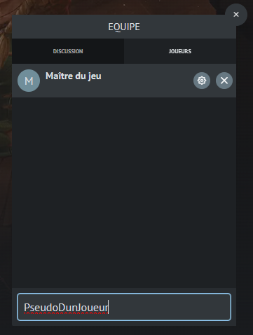
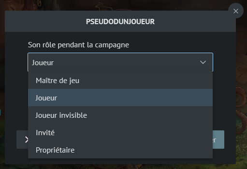

# Inviter des joueurs

L'invitation de joueurs se fait via l'onglet "Joueurs" de la fenêtre "Equipe".

Lorsque le pseudo est valide, vous le verrez s'ajouter dans la liste.
Vous pourrez alors lui paramétrer son rôle.

Les rôles possibles d'un utilisateur :

- Maître de jeu : il a les même droits que vous
- Propriétaire, vous pouvez céder votre campagne à un autre utilisateur, attention cela peut causer des conflits et n'est pas recommandé
- Joueur : Vous pourrez sélectionner les ressources affectées au joueur, il aura un affichage dédié aux joueurs
- Joueur invisible : Même chose que le joueur classique sauf que seul les maîtres de jeu peuvent le voir, l'entendre en vocal et voir ses lancés ! Vous pouvez changer le rôle de ce joueur en cours de partie, il sera alors des autres joueurs et pourra intéragir avec eux

!> Le rôle d'invité n'est pas encore opérationnel, il la sera plus tard dans le développement de l'application.

Lorsque vous ajoutez un joueur à votre campagne, il verra sur sa page d'accueil le raccourcis de votre campagne.

?> Actuellement si le joueur était déjà sur la page d'accueil, il devra rafraîchir la page pour voir le changement.
