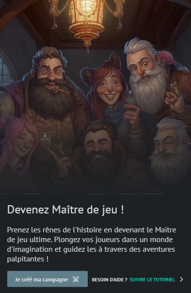
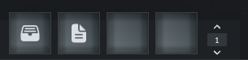
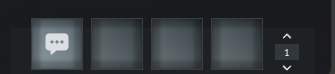

# Création d'une campagne

!> Le Marketplace n'étant pas encore disponible pour la version Alpha, l'utilisation de contenu pré-fait n'est pas encore possible.

Vous pouvez créer une campagne depuis la page "Campagnes" ou depuis l'accueil via cette carte :

Si vous n'avez pas encore créé de système, la campagne se créera automatiquement. Ne vous inquiétez pas, il sera possible de lui assigner un système depuis les paramètres de la campagne !

Vous serez redirigé vers la page du détail de la campagne aussi appellée "Lobby". Vos joueurs ont aussi accès à cette page mais de façon limitée, ils ne peuvent pas voir vos scénarios...

?> Prochainement, il sera possible de définir des planning de session, gérer le recrutement de joueurs... directement depuis le lobby

Cette campagne aura automatiquement toutes les extensions de base. Vous pouvez modifier son nom, sa miniature et lui mettre une image de fond.

## Raccourcis

Deux barres de raccourcis sont situées en bas de l'écran à chaque extrêmités :

> Les raccourcis de gauche permettent de gérer rapidement la médiathèque (ressources, images, vidéos, musiques) et vos notes personnelles liés à cette campagne

> Les raccourcis de droite permettent d'avoir accès au chat de la campagne

