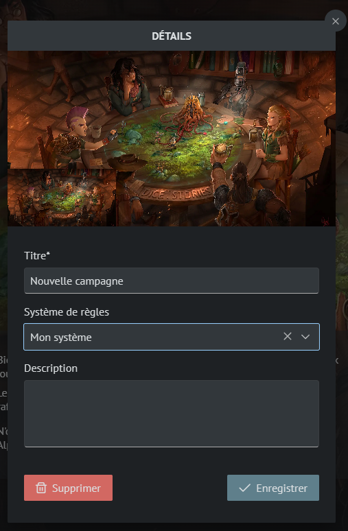
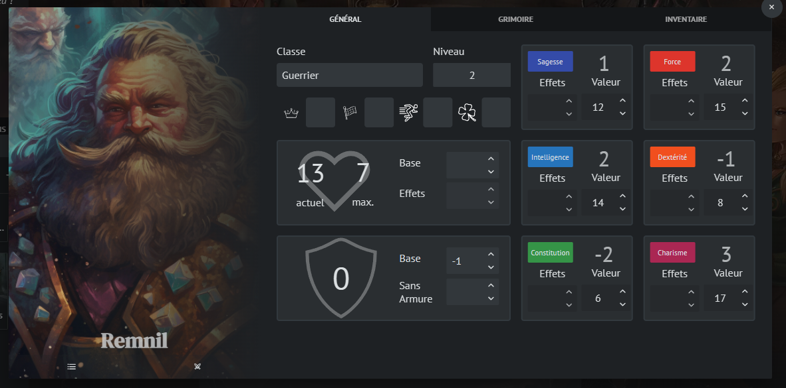

# Création des personnages

Il est temps de retourner dans votre campagne précédemment créée !

Editez votre campagne et modifiez le système de règles en sélectionnant celui que vous avez créé à l'étape précédente.

- Ouvrez la Médiathèque via la barre de raccourcis en bas à gauche.
- Créez un dossier appelé "Personnages"
- Naviguez dans le dossier
- Cliquez sur le bouton "+"
- La popup de création vous propose alors le modèle "Personnage", créé précédemment. Sélectionnez le et validez.

Félicitation ! Vous venez de créer votre premier personnage !

Vous pouvez maintenant l'éditer comme bon vous semble, modifier sa miniature...

Exemple de personnage :

