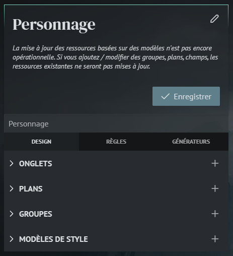
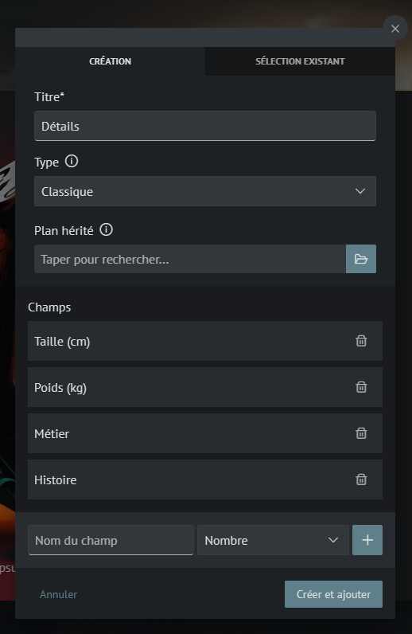
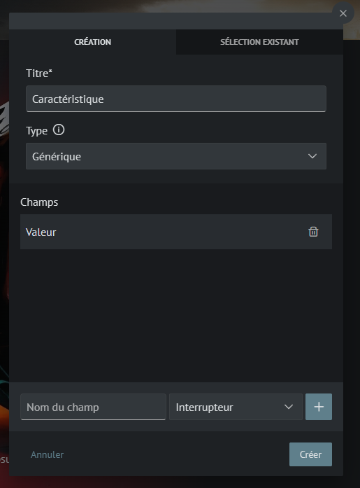
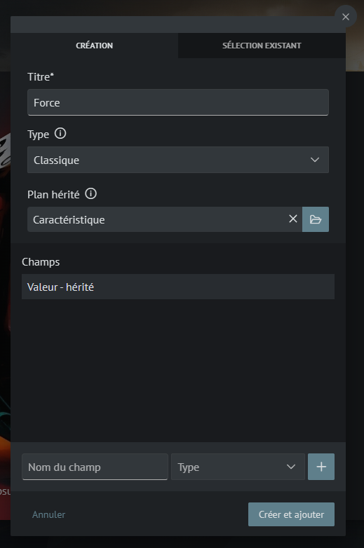
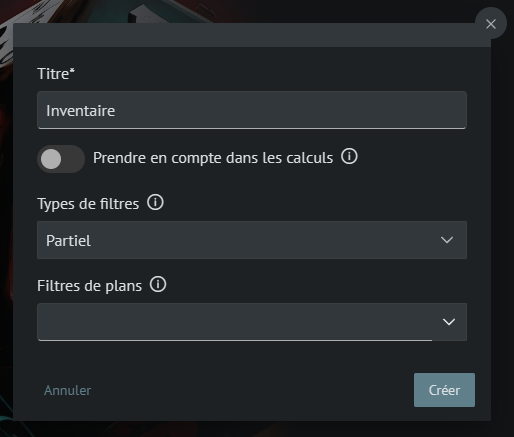
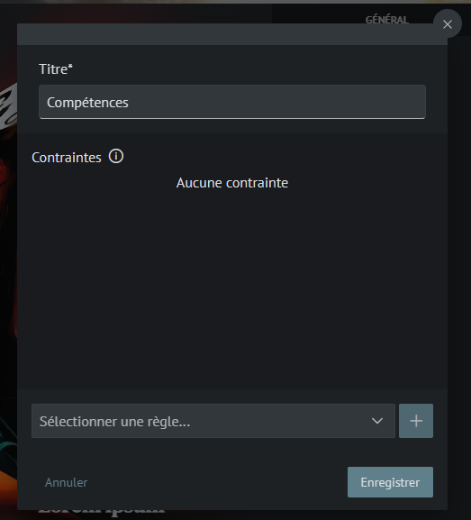
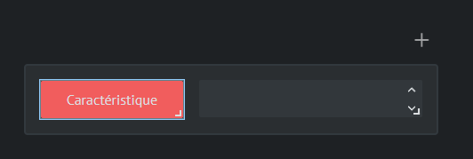
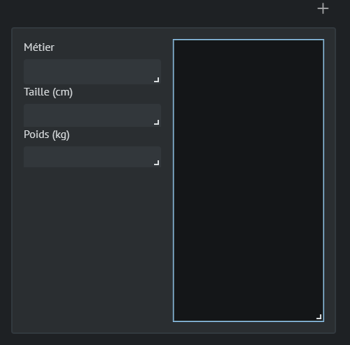
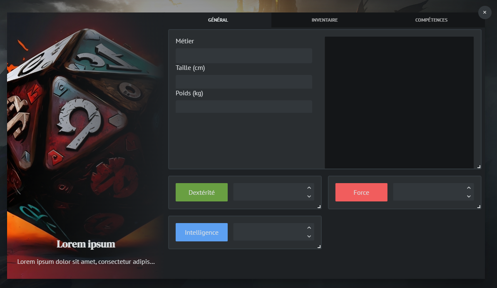

# Création d'un système simple

?> Cette étape sera optionnelle lorsque le marketplace sera disponible.

Maintenant que votre campagne a été créée, il vous faut un système !

Allez à la page "Systèmes" et créez un nouveau système.

Vous pouvez le renommer si vous le souhaitez et changer son image de fond.

Un texte vous invitera à créer votre première "Mise en page".

## Qu'est-ce qu'une mise en page ? :id=layouts

Une mise en page permet de définir quelles données seront présentes dans une ressource mais aussi leur aspect.

Nous conseillons de créer une mise en page par "type" de ressources (Personnages, objets...).

Pour l'instant faisons simple, créons une mise en page "Personnage". Elle permettra de créer facilement les personnages des joueurs, mais aussi les personnages non joueurs, les monstres etc.

## Vocabulaire :id=vocabulary

Plusieurs notions sont abordées ici, on peut les retrouver sur le panneau à gauche de votre page, nous nous concentrerons pour l'instant uniquement sur la partie "Design" de la mise en page.

### Les onglets :id=tabs

Les onglets permettent de créer des onglets de navigation à votre mise en page. C'est très pratique pour regrouper des informations et de limiter le défilement des joueurs.

Il est aussi possible de définir des conditions d'affichage à un onglet. Par exemple, ne pas afficher l'onglet "Grimoire" à un personnage qui n'a pas de sortilèges. C'est une notion plus avancée que vous mettrons de côté pour l'instant.

?> Les onglets ont aussi un avantage au niveau des performances de chargement. L'application ne va charger les données que pour l'onglet affiché. Ainsi, si votre premier onglet n'affiche que les informations les plus courantes (points de vie...), la page sera plus rapide à charger.

### Les Plans :id=blueprints

Un plan est un groupement de données. Chaque donnée est appelée "Champ".

Exemple :

    La caractéristique Force à une "Valeur" et un "Modificateur".

Se traduit par :

    Le Plan Force, à un champ "Valeur" et un champ "Modificateur".

C'est en utilisant les plans que l'on pourra définir des règles, lancés de dés etc.

### Les groupes :id=groups

Ils permettent de regrouper d'autres ressources. Le cas d'utilisation le plus courant est l'inventaire ou aussi les équipements.

Pour ceux deux cas on peut créer un groupe "Inventaire" et un autre "Equipement".

Dans l'inventaire, nous pourrons configurer que toutes les ressources "Objet" peuvent y aller.

Pour le groupe "Equipements" nous pourrons le limiter aux ressources "Equipement", nous ne voulons pas forcément autoriser un joueur qu'il s'équipe d'un vase par exemple.

### Les modèles de style :id=styles

Les modèles de style permettent de styliser un plan. Par exemple, si l'on reprend le plan "Force", on peut définir une icône illustrant ce plan, grossir la taille de l'écriture, positionner le champ "Valeur" etc.

## Tutoriel :id=tutorial

Nous allons vous guider pas à pas pour la création de votre première mise en page. Le but est de vous faire découvrir les notions de base. Certaines notions ne seront pas abordées, vous pourrez consulter les "Notions Avancées" pour en apprendre davantage.

Pour notre mise en page "Personnage" nous voulons avoir les données suivantes :

- Détails
  - Taille
  - Poids
  - Métier
  - Histoire
- Caractéristiques
  - Force
  - Intelligence
  - Dextérité
- Inventaire
- Equipements
- Compétences

### Les Détails :id=details

Commençons par le plus simple ! Crééez un plan "Détails" avec comme champs :

- Taille (cm) - type Nombre
- Poids (kg) - type Nombre
- Métier - type Texte
- Histoire - type Editeur de texte

?> Les types de champs sont en fait des extensions ! Des types par défaut sont disponibles mais vous pourrez en retrouver d'autres sur le marketplace.

?> Quelle est la différente entre les types "Texte", "Zone de texte" et "Editeur de texte" ? Le premier est une simple ligne de texte qui ne peut gérer que du texte simple, le second une zone un peu plus large mais avec les mêmes restrictions et le dernier est un éditeur complet qui permet de mettre en forme le texte, utiliser les listes à puces etc.

### Les Caractéristiques :id=caracteristics

> Chaque caractéristique à une "Valeur".

#### Première solution :

- Créer un plan par caractéristique avec à chaque fois un champ "Valeur"

##### Les avantages :

- Simple à comprendre

##### Les inconvénients :

- Lors de la création de règles, par exemple une règle "Test de caractéristique" nous devrons créer autant de règles que de plans
- Si je veux ajouter un nouveau champ à mes caractéristiques, je dois modifier chaque plan

#### Deuxième solution :

- Utiliser un plan Générique "Caractéristique", lui attribuer un champ "Valeur"

- Créer un plan par caractéristique en indiquant comme "Plan hérité" le plan "Caractéristique"

##### Les avantages :

- Les règles créées pourront être automatiquement appliquées à tous les plans descendant du plan "Caractéristique"
- La modification du plan "Caractéristique" se répercutera sur tous les plans descendant

##### Les inconvénients :

- Un plan en plus de créé

#### Mise en pratique ! :id=how-it-works

Nous allons choisir la deuxième solution qui permet plus de flexibilité.

Commençons par créer notre premier plan "Caractéristique"

#### Plan Caractéristique

Ajoutons le plan "Caractéristique" avec les données suivantes :

> Le champ "Valeur" est de type "Nombre"

#### Plan Force, Intelligence et Dextérité

Ajoutons les 3 autres plans, en sélectionnant le plan "Caractéristique" comme plan hérité.

?> On peut voir que le champ "Valeur" est bien récupéré du plan "Caractéristique"

### Inventaire, Equipements et Compétences

Créer de nouveaux groupes en ne remplissant que le titre.
Les autres informations serviront plus tard.

### Les onglets

Pour agencer plus simplement, nous allons créer 2 onglets.

Par défaut, l'onglet "Général" est créé.

Nous allons ajouter les onglets "Compétence" et "Inventaire" en ne remplissant que le titre.
Les autres informations serviront plus tard.

### Les styles

1. Crééez un style "Caractéristique", sélectionnez un "Plan ciblé" le plan "Caractéristique".
2. Ajoutez via le bouton "+" un champ
3. Dans la rubrique "Données", sélectionner le champ "Valeur"
4. Dans la rubrique "Style"
   - Activer "Afficher les boutons"
   - Activer "Centré"
   - Activer "Maximisé"
   - Activer "Affichage en ligne"
5. Ajoutez via le bouton "+" une zone de texte
6. Dans la rubrique "Style"
   - Texte: saisissez un texte par défaut (on l'éditera pour chaque Caractéristique plus tard)
   - Couleur de fond : définissez une couleur par défaut (on l'éditera pour chaque caractéristique plus tard)
   - Activer les arrondis
7. Positionnez les deux éléments l'un en face de l'autre
8. Enregistrer

Exemple :

1. Crééez un style "Détails", sélectionnez un "Plan ciblé" le plan "Détails".
2. Ajoutez via le bouton "+" les champs du plan
3. Dans la rubrique "Données", sélectionner le champ "Valeur"
4. Laissez la configuration par défaut pour les champs "Métier", "Taille" et "Poids"
5. Configurer le champ "Histoire"
   - Activer "Maximisé"
6. Positionnez les éléments comme vous le souhaitez
7. Enregistrer

Exemple :

### Positionnement

Bravo ! Vous êtes arrivés à la dernière étape !

- Sélectionnez l'onglet "Général"
- Dans le panneau "Plans", cliquez sur tous les plans excepté le plan "Caractéristique"
- Positionnez les comme vous le souhaitez
- sur les 3 caractéristiques, au survol des plans, cliquez sur l'icône de palette
- Sélectionnez la zone de texte
- Modifiez le texte et la couleur en fonction du plan sélectionné

Exemple :

- Sélectionnez les autres onglets et placez-y les groupes de la même manière

> Dans l'onglet "Inventaire", vous pouvez placer le groupe équipement et le groupe inventaire, placez les équipements en premier car il est plus important pour les joueurs

Félicitations ! Vous avez terminé votre première mise en page ! Comme indiqué plus tôt, les règles, les générateurs et autres fonctionnalités vous seront expliquées plus tard dans le tutoriel avancé. Pour l'heure, place à la création des personnages !
