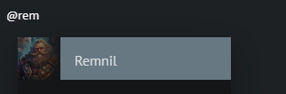

# Ecrire un scénario

Dans votre campagne, sélectionnez l'onglet "Scénarios" et cliquez sur le bouton "+".

Un scénario a été automatiquement créé et lié à votre campagne. Vous pouvez éditer le nom du scénario ainsi que son image de fond.

Par défaut un acte est créé, vous pouvez renommer l'acte si vous le souhaitez. Vous pouvez aussi ajouter autant d'actes que vous le souhaitez en cliquant sur le bouton "+" tout en bas.

## Ecriture d'un acte

Vous pouvez écrire votre aventure dans l'onglet Description d'un acte. Vous pouvez passer en plein écran si vous le souhaitez via le bouton à droite de l'acte.

## Mentionner une ressource

Dans la description de l'acte, vous pouvez mentionner vos ressources en utilisant le caractère `@` suivi du nom de votre ressource. Une liste déroulante s'affichera, sélectionnez l'élément et votre ressource sera automatiquement liée à votre acte.

Cela vous permettra d'accéder à ses informations plus rapidement pendant vos parties.

Vous pouvez retrouver toutes vos ressources dans l'onglet "Ressources".

## Scènes

Il est aussi possible de définir une ressource comme étant une scène. Dans l'onglet Ressources, vous pouvez sélectionner une ressource et la définir comme étant une scène. Vous pouvez définir vos cartes en scènes par exemple, si vous n'avez qu'une scène, celle-ci sera automatiquement affichée lorsque que vous sélectionnerez l'acte lors de votre partie. Sinon vous pourrez choisir manuellement les scènes à diffuser.
