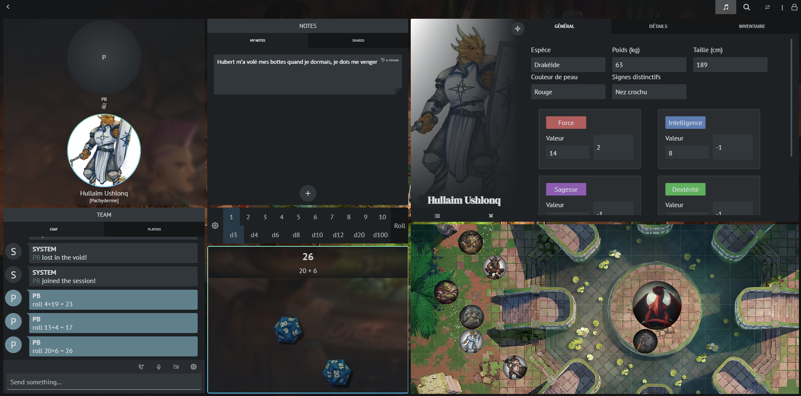
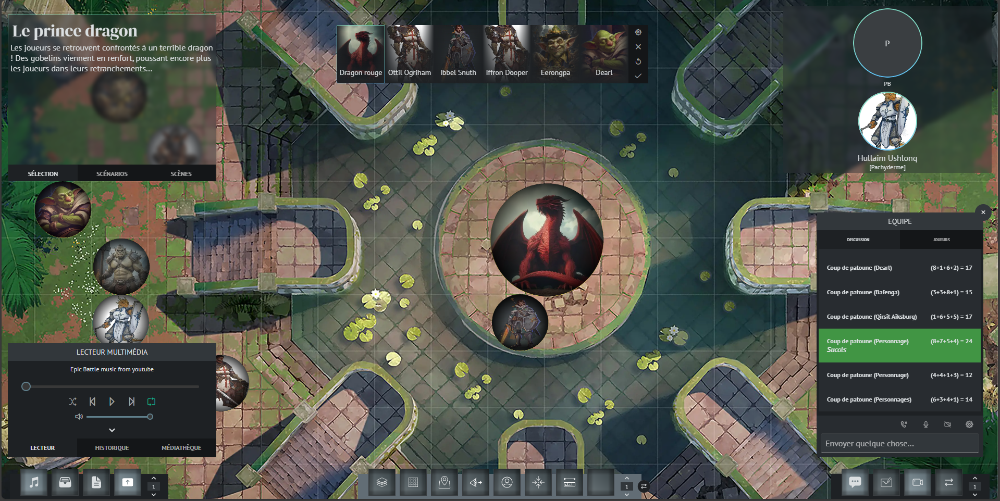

# Lancer une partie

Il vous suffit de cliquer sur le bouton "Jouer" dans le lobby de votre campagne.

Vous serez redirigé vers la page de jeu. Par défaut vous serez en mode concentration comme ici :

C'est un mode idéal pour les phases de rôleplay. Il permet d'accéder à toutes les informations rapidement.

Si vous le souhaitez, vous pouvez passer en vue "plein écran" facilement via le bouton "Changer de vue" en haut à droite de votre écran.

## Se connecter en chat vocal :id=voice-chat

Dans la fenêtre "Equipe", cliquez sur l'icône de téléphone. Vous serez automatiquement connecté aux autres joueurs. Vous pouvez modifier vos réglages de périphériques via l'icône de roue crantée.
